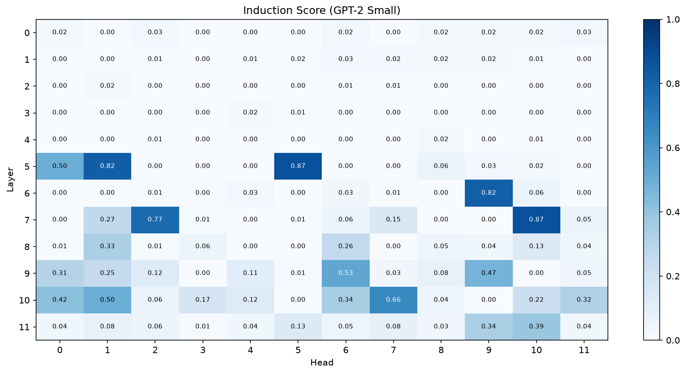
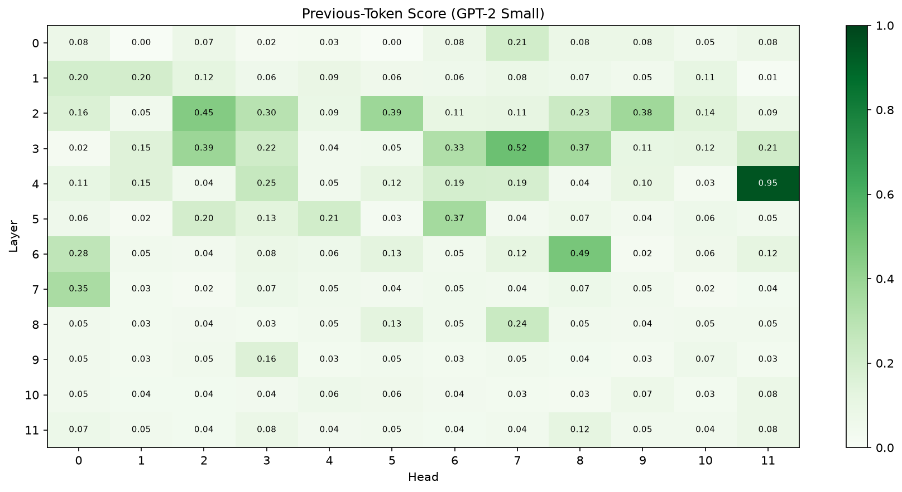
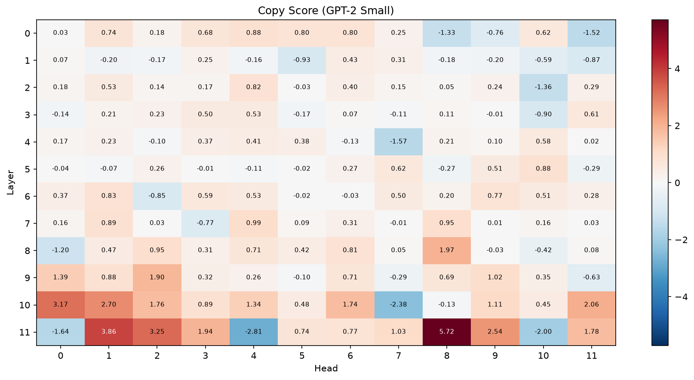
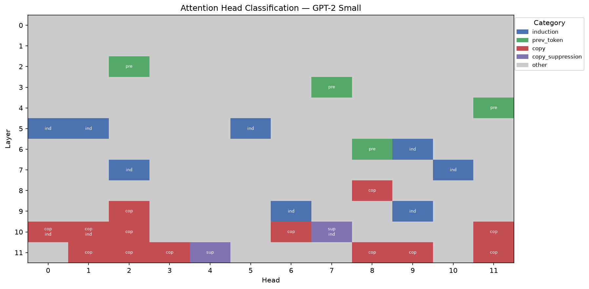

# Attention Head Analysis on GPT-2 Small

Classifying and causally verifying the functional roles of all 144 attention heads
in GPT-2 small (12 layers x 12 heads), using
[TransformerLens](https://github.com/TransformerLensOrg/TransformerLens).

For every head, the project answers two questions: **what behavior does it look like it
implements**, and **does the model causally depend on it for that behavior**. The first is
answered by scoring attention patterns and OV-circuit effects; the second by activation
patching. The point of pairing them is that a correlational label ("this head attends like
an induction head") is only a hypothesis until an intervention shows the model actually
relies on it.

## What I built

The analytical core was written by hand, from the circuit definitions, so I can defend
every step:

- **`scoring.py`** the four head scores (induction, previous-token, copy, copy-suppression),
  including the QK pattern-reading and the OV projection through `W_O` and `W_U`.
- **`classify.py`** the thresholding and labeling logic across all 144 heads, including the
  decision to scale the unbounded copy score into standard-deviation units while preserving
  its sign.
- **`patching.py`** the activation-patching intervention: a forward hook on `hook_z` that
  splices one head's clean activation into a corrupted run, plus the normalized-effect
  metric.

Plotting and environment setup are tooling around that core.

## Method

Four behaviors are scored, grouped by which circuit they probe.

**QK-circuit scores** (where a head attends), measured on a repeated random-token sequence.
Random tokens matter: on real text a head can predict the next token from learned word
associations, so a good prediction is ambiguous evidence. A repeated _random_ sequence
removes every strategy except in-context copying, so a high score can only mean the head is
doing the behavior under test.

- **Induction score**: mean attention from each second-half token to the token that
  followed the previous occurrence of the current token (offset `p - L + 1`).
- **Previous-token score**: mean attention to the immediately preceding token (offset `p - 1`).

**OV-circuit scores** (what a head does to the prediction once it attends), measured on
natural text so copy behavior reflects realistic language. The head's output is routed up
into the residual stream by `W_O`, then read out to vocabulary logits by `W_U`; the score is
the attention-weighted logit it assigns to the token it attended to.

- **Copy score**: positive means the head promotes the token it looks at.
- **Copy-suppression score**: the negative regime of the same signed quantity. A head that
  pushes down the token it attends to is a suppression head.

### Classification

Bounded scores (induction, previous-token, both in `[0, 1]`) use absolute cutoffs read off
the heatmaps, where the gap between the signal cluster and the noise floor is wide. The
unbounded copy score is rescaled by its standard deviation across all 144 heads, so the
cutoff is expressed in sigma units and stays meaningful when the input changes. Scaling is
done without subtracting the mean, so zero stays at zero and the copy / suppression sign
distinction survives. A head that clears no threshold gets an empty label list ("other"),
which most heads do, since these four behaviors are only a slice of what GPT-2's heads do.

### Causal verification

`verify_head_via_patching` runs three forward passes: a clean baseline (induction works), a
corrupted baseline (the repeat is broken, so induction cannot fire), and a patched run where
one head's clean activation is spliced into the corrupted run. The normalized effect

```
(patched - corrupted) / (clean - corrupted)
```

is the fraction of the clean-vs-corrupted gap that restoring a single head recovers. 1.0
means the head fully accounts for the behavior; 0.0 means no causal role.

## Results

I validated each score before trusting any structure it revealed, by checking it flagged the
heads already documented in the literature. The patterns below fell out only after those
checks passed.

### Induction



The score flags **5.1 and 5.5** as the dominant induction heads, matching the canonical GPT-2
result, which is how I confirmed the implementation was correct. Beyond those, **7.10, 6.9,
and 7.2** show up as a secondary cluster. The structural observation: nothing fires below
layer 5. That blank top is the two-layer requirement made visible, since an induction head
cannot function before an upstream previous-token head has run.

### Previous-token



**L4H11** is the cleanest previous-token head, validating that score. Critically, it sits at
layer 4, one layer _above_ the induction heads at layer 5. The two maps are near mirror
images: previous-token behavior peaks early, induction switches on right after, with the
handoff around layers 4 to 5. That ordering is K-composition (the induction head reading the
previous-token head's output through its keys) showing up directly in the data.

### Copy and suppression



Reading the sign: red heads promote the token they attend to, blue heads suppress it. **L10H7**
surfaces as a strong negative, the canonical copy-suppression head, which validated the OV
score. Suppression concentrates in the late layers (10 to 11), consistent with its role as a
calibration brake applied near the output, after the copying done mid-stack.

### Classification



Combining the four scores per head. The strongest induction heads (**5.1, 5.5**) clear only the
induction threshold, not the copy one — a real subtlety rather than a miss. Copy is scored on
natural text, but an induction head's copying is _context-dependent_: it fires in the repeated-
pattern setting, not on generic prose, so a natural-text copy score understates it. Co-labeling
(`cop ind`) instead shows up at **10.0 / 10.1**, and the copy-suppression head **10.7** also
carries an induction label. The map's broad strokes hold: induction in layers 5–9, previous-token
in 2–6, copy concentrated in the late layers, and suppression isolated to 10.7 and 11.4.

### Causal finding: induction is distributed, not localized

Patching a single induction head back into the corrupted run recovers only a small fraction of
the behavior (head 5.1 alone: normalized effect ~0.10). This looked like a failure at first.
It is not: the other induction heads remain corrupted and hold the prediction down, so no
single head can rescue the behavior alone. Induction is carried redundantly across the
five-head cluster. The correlational score says 5.1 attends correctly; the patching result
says no single head is load-bearing. Together they show a distributed circuit, which a
single-head ablation alone would have mischaracterized.

## Limitations

- Copy and suppression scores are raw logit boosts on one corpus; trust the sign and rough
  magnitude, not exact decimals.
- Standard-deviation scaling is robust to the _scale_ of copy scores but not to a
  distributional shift in the input. A fully input-independent alternative would score the
  `W_OV . W_U` weight matrices directly, without any forward pass.
- A null patching result is ambiguous: it can mean a head is unimportant, or that the behavior
  is redundant across several heads. Positive results are strong evidence; absences are not.

## Repository structure

```
src/
  scoring.py    QK and OV head scores (induction, previous-token, copy, suppression)
  classify.py   threshold-based labeling across all 144 heads
  patching.py   activation-patching verification via forward hooks
  plotting.py   score heatmaps and attention-pattern visualizations
analysis.py     driver notebook (# %% cells), run top to bottom
```

## Running it

```bash
python -m venv .venv
source .venv/bin/activate
pip install -r requirements.txt
```

Open `analysis.py` in the VSCode interactive window and run it cell by cell, or convert it
with `jupytext --to notebook analysis.py`. GPT-2 small runs on CPU or Apple Silicon MPS; no
GPU required.

## References

- Elhage et al. (2021), A Mathematical Framework for Transformer Circuits
- Olsson et al. (2022), In-context Learning and Induction Heads
- McDougall et al. (2023), Copy Suppression: Comprehensively Understanding an Attention Head
